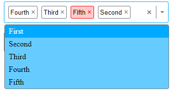

# Select Dropdown Component

This project is a dropdown component developed in React and TypeScript. It allows for the selection of one or multiple options from a list, with support for keyboard navigation and various customizations.

## Overview

This component was created with the aim of practicing the use of React and TypeScript, as well as implementing some user interface (UI) ideas for dropdown menus.

## Features

- Single or Multiple Selection: Allows for the selection of a single option or multiple options.
- Keyboard Navigation: Supports arrow navigation, selection with Enter/Space, and closing with Escape.
- Automatic Closing: Automatically closes when it loses focus.
- Selection Clearing: Button to clear all selected options.

## Screenshot

